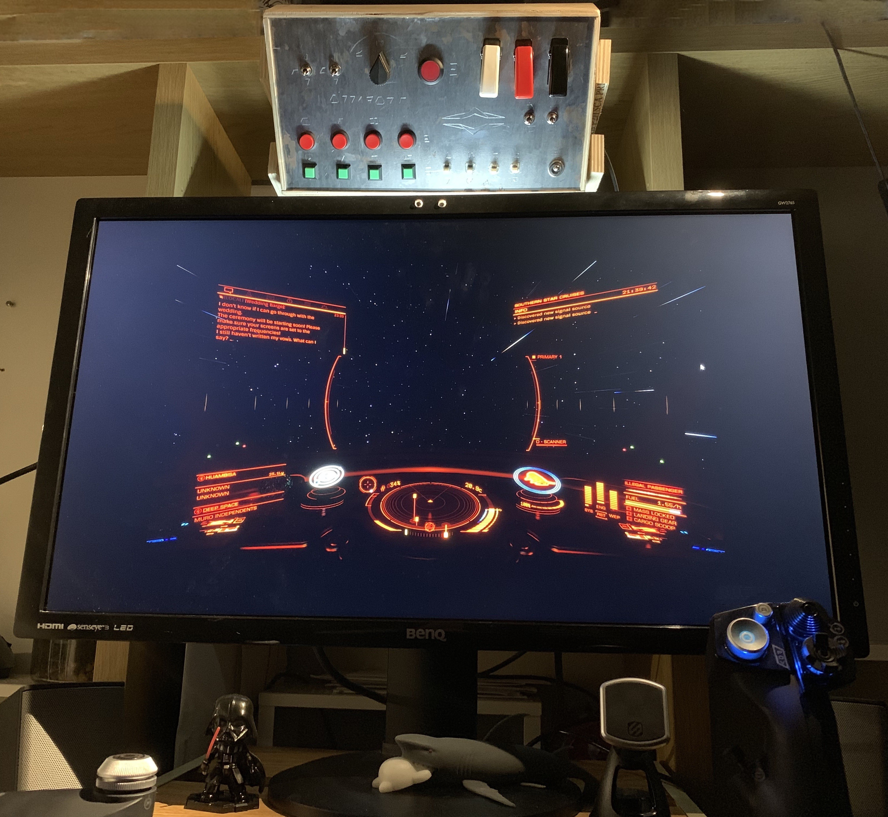

This is Arduino code for a basic panel of buttons and switches designed to output keystrokes to a PC. This was primarily designed to be used in the game Elite Dangerous, but nothing stops it from being reconfigured for another game, or adjusting another games keybindings to work the the panel as is.

Project Details [here](https://westonnovelli.github.io/project-actuator/)

